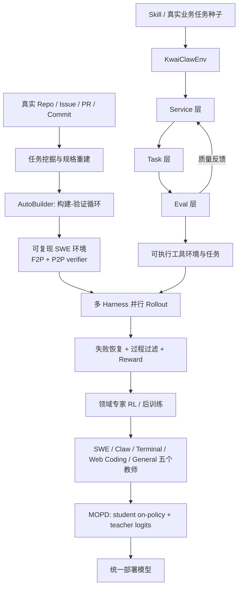
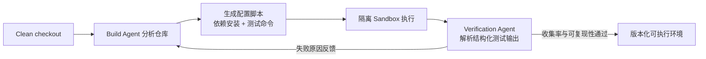
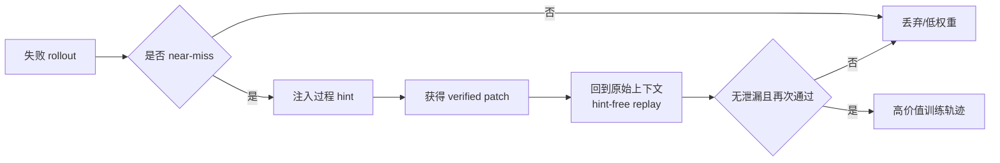
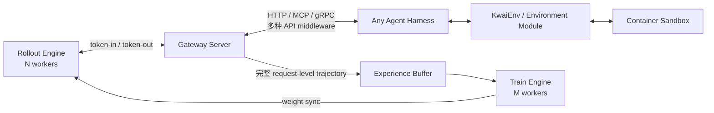

# KAT-Coder-V2.5：架构、训练技术与基础设施深度解读

> 论文：[KAT-Coder-V2.5 Technical Report](https://arxiv.org/pdf/2607.05471)，arXiv:2607.05471v1，2026-07-06，24 页。  
> 阅读范围：重点解读系统架构、数据与训练技术、RL/沙箱基础设施；按要求略去 benchmark 分数与横向排名。  
> 标注约定：**“论文明确披露”**表示原文可以直接支持；**“我的解读/推断”**表示根据论文系统图和机制做的工程分析，不应当成作者披露的实现事实。

## 0. 一句话结论

KAT-Coder-V2.5 的关键并不是论文没有披露的某种新 Transformer 结构，而是一套以 **可执行环境和可信 verifier 为地基**的 agentic post-training 工厂：先把真实仓库加工成可复现、可判分的训练环境，再把 rollout 变成经过恢复和过程审查的高价值轨迹，在多种 agent harness 中做长程 PPO，最后把五个领域专家用多教师 on-policy 蒸馏融合为一个模型。

换句话说，这篇论文真正回答的是：**如何把 coding agent 的训练从“喂代码文本”升级成“在真实软件工程闭环里产生、验证、筛选和学习行为”。**

## 1. 先校准“整体架构”到底指什么

论文几乎没有介绍基础模型的参数规模、Dense/MoE、层数、注意力结构、上下文长度、预训练语料或 tokenizer。因此不能从本文推断 KAT-Coder-V2.5 的底座模型架构。本文的“架构”实际是五层 post-training 系统：

1. **任务与环境生产层**：AutoBuilder 生产真实仓库 SWE 环境；KwaiClawEnv 生产通用工具服务和任务环境。
2. **轨迹生产与提纯层**：并行 rollout、near-miss 恢复、hint-free replay、规则过滤和过程评分。
3. **Agentic RL 执行层**：多个白盒/黑盒 harness、Gateway、KwaiEnv、容器沙箱、Experience Buffer、Rollout/Train Engine。
4. **优化与奖励层**：PPO + GAE、带 hindsight 的非对称 Critic、规则奖励、模型过程奖励。
5. **能力融合层**：五个领域专家通过 Multi-Teacher On-Policy Distillation（MOPD）蒸馏进统一 student。



这套架构的中心并不是 Trainer，而是 **Environment–Verifier–Trajectory 三角**：

- Environment 决定模型看见什么状态、能采取什么动作；
- Verifier 决定“成功”是否真实，直接形成奖励；
- Trajectory 决定模型最终学到的是可迁移的工程方法，还是对测试/harness 的投机。

## 2. SWE 任务工厂：AutoBuilder

### 2.1 可验证任务的最小单元

论文把一个 SWE 训练样本定义为三元组（§2.1，pp.3–4）：

```text
Task = (精确任务描述, 可执行仓库环境, validation tests)
```

Agent 从固定的初始仓库状态出发产生 patch；只有 validation tests 全部通过才算正确。这里的 tests 又分成：

- **fail-to-pass（F2P）**：在原始缺陷版本失败，正确修复后应通过；
- **pass-to-pass（P2P）**：原本就通过，修复后仍必须通过，用来阻止回归和粗暴绕过。

这个定义很重要：它把自然语言 coding 问题变成了一个可执行 MDP/交互任务，也为 SFT 筛选、RL reward 和最终验证提供同一个事实来源。

### 2.2 从 PR 工件重建任务，而不是照抄 issue

原始 issue/PR 描述常常含糊、缺上下文，甚至与最终 merge 的实现不一致。系统因此以 golden patch 和 test patch 为证据，重新生成三段式规格：

| 规格组成 | 主要证据 | 作用 |
|---|---|---|
| Problem statement | golden patch | 描述 bug 或缺失能力 |
| Requirements | test patch | 明确可观察的期望行为 |
| Interface constraints | 两种 patch | API、变量、数据结构、兼容性约束 |

之后再做 clarity check，淘汰含糊、不完整、欠约束或内部矛盾的样本。

**我的解读**：这是“从答案和验收条件反推题目”。好处是题目与 verifier 对齐，能显著降低 false-negative reward；风险是生成题目时可能泄漏实现细节。论文只说做了 clarity check，没有披露独立的 solution-leakage 检测器、人工抽检规模或 inter-annotator agreement，因此“精确”与“不过度提示”之间如何平衡仍不透明。

### 2.3 AutoBuilder 的 agent-driven 构建—验证循环

AutoBuilder 不是单次生成 Dockerfile，而是一个闭环（§2.1）：



验证的关键不是 exit code，也不是在 log 中搜索 `passed`，而是解析具体测试框架的结构化输出。接收条件至少包括：

- 收集到预期测试的 90% 以上；
- 多次运行的 pass/fail 结果可复现；
- 后续能够运行 F2P/P2P verifier。

为了扩大构建规模，它组合了三种复用手段：预配置 base environment、语言/构建系统模板、从成功配置提炼出的可检索 build recipe 库。后者本质上是 environment construction 的经验记忆/RAG，让新仓库不必从零试依赖和测试入口。

此外还有两类数据卫生处理：

- 若 reference change 中的依赖升级或环境配置不是题目要考的内容，就预先应用，避免 agent 把时间花在环境修复上；
- 删除 git history、commit metadata 等可反查 reference solution 的痕迹。

**关键理解**：环境构建并非数据准备的外围脚本，而是训练系统的第一阶段模型能力放大器。环境失败会把“本来会做题”误记为失败，环境接受了假测试又会把“什么都没验证”误记为成功；二者都会直接污染策略梯度。

### 2.4 AutoBuilder 仍未回答的问题

- “预期测试集合”如何确定，尤其跨 12 种语言和大量自定义 runner？
- 允许最多 10% 测试未被收集，是否会系统性漏掉昂贵 integration/e2e tests？
- 可复现要求运行几次，如何处理 flaky tests、网络依赖、时间/随机数依赖？
- reference change 的环境编辑与目标代码编辑如何自动分类，错误预应用是否会泄题？
- image、dependency lock、外部 registry artifact 是否用 digest 完整固化？
- verifier 是否与 agent workspace/权限隔离，从机制上阻止改测试或改判分脚本？

## 3. SWE 数据飞轮：不把“测试通过”误当成“轨迹优质”

### 3.1 Near-miss 的两阶段恢复

普通 rejection sampling 会扔掉所有失败轨迹。论文认为很多失败其实已经完成定位，只差一个关键动作，例如没读决定性 assertion、schema 差一点、没复用已有机制，或第一次测试失败后过早停止。

恢复过程是：

1. 对 near-miss 注入 **过程级 hint**，提示“看哪里/验证什么”，但不直接给答案；
2. hinted rollout 得到通过 verifier 的 patch；
3. 固定这个 verified patch，从原始任务上下文重新生成一条 **无 hint 轨迹**；
4. 只保留无 hint 泄漏、与 patch/test 一致且再次验证通过的样本。



**我的解读**：这类似“先用 teacher/scaffold 找到可行解，再做无脚手架的行为克隆轨迹”。它提高了困难任务的数据利用率，但也存在 **post-hoc rationalization** 风险：如果重放时已经固定正确 patch，生成的搜索与思考过程可能只是对答案的合理化叙事，而不是真正在线发现答案的因果过程。论文没有说明 patch 如何提供给 replay 模型、哪些内容被 mask、如何检测隐式泄漏。

### 3.2 过程评分与过滤

论文明确指出 passing trajectory 也可能是坏数据：硬编码、改测试、绕过项目机制、探索不足或验证草率。因此流水线先用硬规则移除 invalid/unstable/exploit 轨迹，再按多个过程维度做启发式评分：

- exploration 与 localization；
- edit 前推理和 specification fidelity；
- 是否遵循仓库惯例、是否复用现有机制；
- patch minimality；
- verification 与失败恢复；
- honesty。

低质量成功样本会被降权或移除；可恢复失败样本送回 hint 流程；正负过程标注还能用于 preference learning、rejection sampling 和 process reward modeling。

这说明他们的数据 flywheel 不是单一 SFT 数据管线，而是一个可为多种训练范式供料的轨迹资产层。

### 3.3 Harness rewriting 是数据增强，不只是协议适配

工具名、参数约定、输出格式、prompt 模板会被随机改写，同时注入依赖缺失、暂时性命令失败、输出截断和噪声日志。因为最终验证锚定在结构化测试结果，同一任务可以被不同接口“重新上架”。

这相当于 agent 世界里的 domain randomization：保持任务语义和可执行动力学近似不变，随机化 observation/action 表面形式，逼模型学习不依赖某套 CLI 语法的解题策略。

## 4. 通用工具环境：KwaiClawEnv

AutoBuilder 解决真实仓库 coding；KwaiClawEnv 解决跨服务、多工具、长链路的通用 agent 训练。它采用 Service–Task–Eval 三层闭环（§3，pp.5–8）。

### 4.1 Service 层：先构造可执行能力原子

Service 有两类来源：

- 人工编写或开源社区的 Skill definition；
- LLM 按类别生成、补齐长尾领域的 Service。

系统从 Skill 中解析 API spec、参数 schema、使用约束，产出带 OpenAPI 描述、容器配置和 fixture data 的可部署服务。原子 Service 还可以 chain/nest 成 composite capability。进入下游前会检查可执行性、接口一致性和逻辑正确性。

**我的解读**：这里选择“真实可执行服务 + fixture state”，而不是让另一个 LLM 模拟工具返回值，是为了让状态转移确定、可检查。它牺牲了部分真实互联网复杂度，却避免 simulator hallucination 直接进入 reward。

### 4.2 Task 层：从真实种子可控扩展难度

每个 seed task 包含明确目标、工具使用 exemplar 和机器可验证成功条件。扩展机制有三类：

- parameter expansion；
- constraint augmentation；
- tool-chain orchestration。

难度比例、工具链长度、工具来源组合均可控。系统并行 rollout，完整记录 model decision、tool call、tool output 和 state transition。因此训练样本不是静态 QA，而是端到端可追溯 execution trace。

### 4.3 Eval 层：统一格式、过滤并反哺上游

Raw trajectory 先转成统一训练格式（例如 SFT-ready），补齐缺失/辅助字段；再经过：

1. **硬规则**：工具黑名单、文件存在性、必需工具覆盖、状态一致性等；
2. **LLM-as-Judge**：语义正确性、执行效率、交互自然度。

质量信号会反馈给 Service/Task 层，修正后续服务生成和任务派生。全生命周期还有三级一致性检查：

| 阶段 | 检查内容 |
|---|---|
| Service availability | endpoint 可达、OpenAPI 完整、跨服务依赖连通 |
| Task generation | schema 合法、工具引用与参数一致、成功条件可机器验证 |
| Execution environment | 容器启动、fixture 加载、agent 交互、轨迹完整、scoring 正确 |

样本被统一分类为 repairable failure、rejected defect 或 production-ready，避免所有失败都走同一种处理路径。

### 4.4 两个环境工厂的共同抽象

AutoBuilder 和 KwaiClawEnv 表面不同，底层其实共享同一个设计：

```text
现实工件/种子
  -> 结构化任务规格
  -> 可版本化的初始状态
  -> 可执行 action space
  -> 确定性或可审计的 state transition
  -> machine-verifiable success criteria
  -> 完整 trajectory + reward provenance
```

这是整篇论文最可复用的架构思想：**先建立可信的交互世界，再讨论 RL 算法。**

## 5. 多 Harness 训练：把 harness 当作训练分布的一部分

固定 harness 会带来三类过拟合（§4.1，pp.8–9）：

- **格式过拟合**：只会某种 function-call/tag/code-block action protocol；
- **上下文结构过拟合**：依赖固定的历史拼接、窗口或压缩格式；
- **控制流过拟合**：依赖 harness 在固定时机替它 plan、reflect 或 stop。

系统沿三个轴做 harness scaling：tool invocation protocol、context management、control-flow complexity。论文把 harness 分成：

- **白盒 mini-swe-agent**：控制流简单、不压缩轨迹、工具少，信号干净，目的是学习“裸”的 agent 能力；
- **黑盒 Claude Code、Codex、OpenClaw、OpenHands 等**：内部有压缩、重组、复杂控制流，更接近部署分布，作为 opaque execution box 接入。

白盒和黑盒不是二选一。前者降低训练信号噪声，后者提供部署鲁棒性；组合起来类似 curriculum + domain randomization。

一个值得注意的张力是：奖励中又会惩罚工具调用格式、位置、并行度等 harness 行为。如果不同 harness 的规范不同，reward service 必须按 harness 配置解释行为，而不能使用全局固定规则。论文称之为 harness-oriented reward，但没有披露规则如何按协议实例化。

## 6. Agentic RL Infra：数据流与关键不变量

### 6.1 总体拓扑

论文披露三个原有核心模块和一个新增 Gateway（§4.2，pp.9–11）：

- **Rollout Engine（N workers）**：运行 policy inference；
- **Train Engine（M workers）**：从轨迹计算更新；
- **KwaiEnv**：托管 harness 对应环境和 sandbox；
- **Gateway Server**：隔离 trainer 与 harness，协调请求、token 和 experience 写入。



系统图中的 middleware 同时适配 Anthropic、OpenAI Chat、OpenAI Responses 等协议。这一层让 Trainer 不需要理解 Claude Code/Codex/OpenHands 内部状态机；任意 harness + execution environment 都可作为黑盒挂载。

### 6.2 Gateway 的第一职责：解耦交互和训练

Rollout Engine 不直接碰环境模块。Gateway 在 trajectory 完成后写入 Experience Buffer，Train Engine 从 buffer 采样更新。这样形成三个边界：

- rollout 只负责 policy token generation；
- harness 只负责把 token 解释成动作并管理控制流；
- trainer 只消费规范化 experience，不依赖 harness 内部实现。

**工程含义**：真正困难的是 experience schema。它至少需要带上 policy/version、task/env/verifier/harness 版本、raw token IDs、每轮 observation/action 边界、tool error、sandbox health、reward component 和最终 patch，否则无法做 on-policy 判断、故障归因和重放。论文没有公布 schema。

### 6.3 Gateway 的第二职责：消灭 retokenization drift

常规 chat endpoint 会重新套 `apply_chat_template` 并重新 tokenize。长达约 200 轮时，只要客户端记录的 token 与 inference backend 实际采样 token 不同，训练阶段计算的 behavior-policy log-prob 就不再对应真实动作，PPO importance ratio 会失真。

论文的处理非常直接：绕过 chat API，把请求直接送到 inference backend 的 `/generate`，确保进入训练的每个 token 与 rollout policy 实际吐出的 token 完全一致。

这是 infra 与算法紧耦合的典型例子：对普通推理服务，“文本语义相同”可能够用；对 on-policy RL，**token identity 是数学正确性条件**。Gateway 因而不只是 API proxy，也是 trajectory ledger/token authority。

### 6.4 Sandbox 可靠性就是 reward 可靠性

作者审计早期 rollout，发现约 16% 轨迹至少含一次由 sandbox 而非 policy 造成的失败。最严重时，一次边界错位会让后续约 40 step observation 为空，整条轨迹 reward 被污染。

论文给了两个很有价值的生产事故案例：

#### 案例 A：容器镜像与磁盘 GC 抖动

- 大量并发拉取大镜像；
- 物理盘峰值约 95%，GC 几乎连续运行；
- 初始化/执行变慢并触发 timeout；
- 通过 image early-release，主动清理预计不会复用的镜像；
- 稳态磁盘占用降至约 60%，timeout invalid rollout 从约 6%–7% 降至 1% 以下。

#### 案例 B：远程初始化环境变量覆盖 verifier 配置

- sandbox 初始化设置的系统环境变量覆盖系统配置；
- verifier 读取错误变量，约 6%–7% 样本被翻转 reward；
- 修复后降至 1% 以下。

总体 sandbox feedback error 从约 16% 降到 2% 以下，training collapse 频率下降约一个数量级。这里的数字不是 benchmark，而是理解系统可靠性的关键信号。

### 6.5 我认为生产实现必须守住的 infra invariant

以下是基于论文机制的工程重建，并非作者明确披露：

1. **不可变版本链**：`task_id + base_commit + image_digest + fixture_version + verifier_version + harness_config_hash` 唯一决定环境。
2. **token 单一事实源**：buffer 保存 backend 实际 sampled token IDs 和 log-probs，而不是从文本事后重编码。
3. **policy freshness**：每条 trajectory 记录 rollout policy version；Train Engine 对过旧样本丢弃或严格做 staleness 控制。
4. **环境错误与策略失败分离**：sandbox health/error 是单独标签；infra failure 不得映射成 task reward 0。
5. **verifier 隔离**：agent 不能修改 hidden tests、scorer 或 reward inputs；判分最好在只读、独立 namespace 中进行。
6. **幂等与可重放**：同一 environment manifest 能重建；Gateway 重试不得重复写 experience。
7. **可观测性**：按 image、host、language、harness、task bucket 监控 cold start、timeout、empty observation、test collection、reward flip 和轨迹丢弃率。

### 6.6 论文未披露但决定可复现性的 infra 细节

- Rollout 与 Train 是同步 PPO、异步 PPO，还是 bounded-staleness pipeline？
- weight sync 周期、buffer 容量、样本 TTL、backpressure 和 straggler 处理；
- 推理/训练 GPU 拓扑、并行策略、KV cache 管理、长上下文切分；
- sandbox scheduler、容器运行时、网络隔离、资源配额、恶意代码防护；
- 镜像缓存淘汰策略是 LRU、预测复用还是 task-aware pinning；
- flaky verifier 的重试/仲裁协议和 reward confidence；
- trajectory compression 后，token/action 边界如何映射到 PPO loss mask；
- harness 的 sub-agent split/query rewrite 如何合并成 session-level provenance。

因此，这篇报告足以理解设计思想，却不足以复现他们的 RL 集群。

## 7. 长程优化：为什么选择非对称 Actor–Critic PPO

### 7.1 为什么不是只用 trajectory-level GRPO

作者把 agentic RL 描述为长时程、部分可观察、状态转移随机的问题，并认为 GRPO 一类 critic-free 方法在这里有粗粒度 credit assignment 和高方差问题（§4.3，pp.11–12）。他们选择 PPO 的理由是：

1. 生产 harness 会因为 context compaction、sub-agent split、query rewrite，把一次 session 结构化拆成多段。它们最终结果相同但 prefix 不同，很难定义一致的 group baseline；
2. PPO 的 token-level contribution 更自然；
3. Critic 可以吃训练期 privileged information，降低 value estimation 方差；
4. PPO + GAE + reward shaping 可以在 turn/token 层面对局部坏行为分配责任，而不是整条轨迹一刀切。

Actor 使用标准 clipped PPO objective，importance ratio 是当前 policy 与 rollout behavior policy 的逐 token 比值；advantage 用 GAE，Critic 回归 return target。真正的新点不在 PPO 公式，而在 Critic 的输入。

### 7.2 Hindsight-Augmented Asymmetric Critic

Actor rollout 时只能看当下可用信息：此前交互、工具输出、文件片段、压缩摘要。Critic 在训练时额外获得 hindsight context `c_t`：

- 最终 pass/fail；
- unit-test outcome distribution；
- coverage；
- patch-level diff；
- task metadata；
- trajectory statistics；
- subsequent turns。

于是 value function 从 `V(s_t)` 变为 `V(s_t, c_t)`。部署时 Critic 和 hindsight 全部丢弃，只留下 Actor。

```text
Rollout / inference:
Actor:  s_t  -> action

Training only:
Critic: (s_t, final outcome, tests, coverage, diff, future turns, ...) -> value
Actor:  使用该 Critic 形成的 advantage 做 PPO 更新
```

这类 asymmetric actor–critic 的直觉是：Actor 不允许作弊，但教练可以看完整比赛录像后判断“第 t 步到底有多关键”。对于稀疏的最终 test reward，它能把结局信息向前传播，减少把所有中间动作视作同等好坏的噪声。

### 7.3 这一设计的风险

- Critic 可能学成“看到最终结果就报答案”的 outcome classifier，而非对 Actor 可控制因素做价值分解；
- hindsight 中含 subsequent turns，若构造 GAE 时上下时刻的信息集不一致，可能引入偏差或过强的 advantage shaping；
- patch diff/coverage 与 golden artifacts 的来源必须严格限定，否则 Critic 会用与真实行为无关的泄漏特征拟合 reward；
- 论文没有给出 asymmetric critic 对普通 critic/GRPO 的消融、value calibration 或 explained variance；
- Critic 的架构、是否与 Actor 共享 backbone、额外上下文如何编码均未披露。

所以它在概念上非常适合长程 agent，但目前更像一个有说服力的系统设计，而不是已被充分拆解验证的算法结论。

## 8. Reward：终局正确、过程纪律与失败进展三层叠加

### 8.1 规则奖励

规则 reward 分三层（§4.4.1，pp.12–14）：

#### 第一层：Core Task Score

权重最高，只有全部 F2P 与 P2P 都通过才给满分。目标是同时保证修复和不回归，并阻止无效代码、绕过逻辑、削弱测试等 reward hacking。

#### 第二层：Standard Behavior Constraints

贯穿整条轨迹的辅助惩罚：

- 内容重复、乱码/非法符号；
- tool 参数错误；
- tool call 放在错误的 reasoning 位置；
- 单轮重复调用同一工具；
- 超阈值的过度并行调用。

它们解决的是协议稳定性、成本和工程行为规范，不直接代表代码语义正确性。

#### 第三层：Failed Trajectory Incentives

失败轨迹也获得进展信号：

- **File Search Accuracy**：用 F2 平衡相关文件召回与无意义广搜；
- **Unit Test Pass Rate**：通过部分 F2P/P2P 也得到正反馈。

这使 reward 从纯二值终局信号变得更稠密。

**风险解读**：File Search F2 的 ground truth 很可能来自 golden patch 涉及文件（论文未明确），这会惩罚“不同但正确”的定位路径；partial test reward 可能鼓励只修容易子案例。因此最高层 all-or-nothing core reward 必须足够强，且 reward coefficient/normalization 很关键，但论文未公开这些参数。

### 8.2 模型过程奖励与 GRM

规则无法判断“测试是否充分”“失败后有没有调整策略”“是不是盲扫大文件”。作者从真实坏轨迹人工归纳 rubric，覆盖三维：

- fault diagnosis and reproduction；
- post-fix verification；
- execution strategy。

原始 base model 不能稳定遵循 rubric，于是另训一个 specialized judge——GRM。训练数据是历史 trajectory + 人工标注的 rubric trigger/rationale，并人工过滤只保留证据充分的标签。GRM 自身再做 targeted RL：reward 以 ground-truth violation 的 recall 为主，同时用系数 `λ` 惩罚多报 false positive。

这套设计是“用人类失败分析定义 ontology，再训练分类型 reward model”，比让通用 LLM 直接给一个模糊总分更可审计。代价是 rubric 覆盖范围决定盲区，而且 recall-oriented objective 可能在 `λ` 不合适时过度处罚正常探索。

## 9. 五专家融合：Multi-Teacher On-Policy Distillation

### 9.1 为什么不做权重平均或顺序 SFT

系统先得到五个领域专家：

1. agentic software engineering；
2. general agentic reasoning / Claw；
3. terminal use；
4. web coding；
5. general knowledge。

参数平均、Task Arithmetic 或顺序多域 SFT 容易出现 see-saw：一个领域变好，另一个变差。论文将原因归结为参数空间合并破坏专家结构，以及离线监督造成 train–inference distribution mismatch。

### 9.2 MOPD 的核心流程

对于带 domain `d` 的 prompt `x`：

1. **student 自己**生成 on-policy trajectory `y ~ π_student(.|x)`；
2. 对同一条 student prefix，选择领域教师 `π_teacher_d` 计算逐 token logits；
3. student 最小化 `KL(student || teacher_d)`，即 reverse KL；
4. 每个 token 乘 drift-aware 权重 `w_t`。

Reverse KL 是 mode-seeking：倾向把概率集中到 teacher 的高置信区域，而不是覆盖 teacher 的所有 mode。函数空间蒸馏也避免直接混合五套权重结构。

### 9.3 为什么纯 on-policy 蒸馏在长上下文会坏

student prefix 越长，越可能偏离 teacher 的训练分布；此时 teacher 在“它自己不会走到的状态”上给出的 logits 未必可靠。reverse KL 又可能加剧对错误局部 mode 的过度自信，表现为 loss oscillation、entropy collapse、gradient norm spike。

作者用了两个稳定器：

#### Off-policy cold start

先在 teacher-generated trajectory 上做标准 next-token NLL/SFT，让 student 靠近各 teacher 分布，再开始 on-policy 阶段。这相当于先让 student 学会基本路线，再让它在自己的状态分布里接受纠偏。

#### Drift-aware dynamic truncation

在 token `t`，取 teacher 与 student 的 top-k token 集合，定义交集比例：

```text
rho_t = |TopK_teacher(t) ∩ TopK_student(t)| / k
```

- `rho_t` 高：teacher 在当前 student prefix 上仍可信，token 权重高；
- `rho_t` 低：降低或置零 `w_t`；
- 连续 `m` 个 token 低于硬阈值：截断后续梯度。

截断只是 gradient mask，不把“偏好短序列”写进目标；截断点前的有效 prefix 仍保留，并用 length-stratified batching 维持长样本占比。

### 9.4 MOPD 的工程成本和不确定点

- 每条 student rollout 还要跑对应 teacher 的逐 token logits，长轨迹下 inference 与通信成本很高；
- 若存 full-vocab logits，I/O/存储巨大；若在线蒸馏，需要 student/teacher 服务调度与 prefix cache；
- top-k set overlap 只看集合，不看概率校准：两个分布即使 top-k 一样，置信度也可能完全不同；
- `k`、阈值、连续长度 `m`、`w(rho)`、domain sampling ratio 均未披露；
- dynamic truncation 节省了无效梯度，却可能系统性忽略最困难的长尾后缀；length-stratified batching 只能缓解长度偏置，不能保证语义难度不偏；
- teacher 是否同架构、是否共享 tokenizer、如何处理不同 tool vocabulary，论文没有说明。

## 10. 把完整训练流程串起来

论文没有给出一张严格按时间排序的 training recipe。下面分“明确”与“合理推断”重建：

### 10.1 论文明确披露的依赖关系

```text
可验证环境/任务
  -> 并行 rollout
  -> near-miss hint recovery + hint-free replay
  -> 规则/过程过滤，形成 SFT/preference/process-reward 可用数据
  -> 多 harness agentic RL（PPO + asymmetric critic + shaped reward）
  -> 五个领域专家
  -> teacher trajectory cold start
  -> multi-teacher on-policy reverse-KL distillation
  -> 统一 student
```

### 10.2 合理但未被论文完整确认的阶段化理解

1. 用经过过程筛选的成功轨迹做领域 SFT/冷启动；
2. SWE、Claw、Terminal、Web、General 各自使用其环境和 reward 做领域 post-training/RL；
3. 训练单独的 GRM，为 SWE 过程行为提供 reward；
4. 用五个专家的生成轨迹对统一 student 做 off-policy cold start；
5. student 在各域 prompt 上 rollout，再由对应教师提供 logits，做稳定化 MOPD；
6. 最终仅部署 student Actor，不部署 Critic、GRM 或 teachers。

这里最需要向作者确认的是：各专家的 SFT/DPO/RL 先后次序、是否从同一个 base checkpoint 出发、MOPD 后是否还有一次统一 RL，以及 MOPD student 是否就是某个专家初始化。

## 11. 这套系统最深的三个思想

### 11.1 Verifier-first，而不是 Algorithm-first

作者一开始把训练不稳定归因于 RL 算法，后来发现大量问题来自 sandbox。只要 6%–16% reward 会被环境随机翻转，再精巧的 advantage estimator 也只是在拟合脏标签。因此优先级应是：

```text
环境/判分正确性 > 轨迹可追溯性 > reward 设计 > 优化算法微调
```

### 11.2 训练对象是“工程过程”，不是最终 patch 文本

同一正确 patch 可以由好过程或坏过程产生。只保留最终代码会丢掉 search、localization、verification、recovery；只看测试通过又会保留投机路径。论文把完整交互过程作为一等数据，并让过滤、reward 和 critic 都消费过程证据。

### 11.3 Harness 是 environment distribution 的一部分

Agent 的真实 policy 输入并不是抽象的“仓库状态”，而是被某个 harness 格式化、截断、压缩和调度后的 observation。更换 harness 等价于 observation/action interface domain shift。多 harness RL 因而不是兼容性测试，而是提升策略不变性的训练手段。

## 12. 如果要复刻，建议的最小系统分层

以下是基于论文抽象出的落地蓝图，不代表 KAT 的原始实现：

| 子系统 | 最小职责 | 必须版本化的工件 |
|---|---|---|
| Task Registry | 任务规格、初始 commit、hidden verifier 引用 | task schema/version |
| Environment Builder | 依赖、镜像、fixture、测试入口 | image digest/build recipe |
| Verifier Service | F2P/P2P、结构化测试解析、重复运行 | verifier code + expected tests |
| Harness Gateway | 协议适配、raw token ledger、session provenance | harness config/tokenizer/policy id |
| Sandbox Fleet | 隔离执行、资源限制、健康诊断 | runtime/host/image/health event |
| Trajectory Store | observation/action/tool/state 全链路 | immutable trajectory manifest |
| Reward Service | core/process/infra-error 分离 | component score + rule/model version |
| Rollout Scheduler | 多环境、多 harness、并发与 backpressure | assignment/policy freshness |
| RL Trainer | PPO/GAE/asymmetric critic | batch provenance/checkpoint |
| Distillation Engine | teacher logits、drift mask、长度分桶 | teacher/domain/top-k/truncation config |

最小 trajectory manifest 建议至少包含：

```yaml
identity:
  task_id: ...
  environment_digest: ...
  verifier_version: ...
  harness_config_hash: ...
  policy_checkpoint: ...
  tokenizer_hash: ...
steps:
  - raw_token_ids: [...]
    behavior_logprobs: [...]
    observation_ref: ...
    tool_call: ...
    tool_result_ref: ...
    sandbox_health: ok | infra_error
outcome:
  patch_ref: ...
  f2p_results: ...
  p2p_results: ...
  reward_components: ...
  judge_version: ...
```

这份 manifest 的价值是：任何异常 reward 都能追到 task、image、host、harness、tokenizer、policy 和 verifier，而不是只剩一条不可复现的总分。

## 13. 论文的主要信息缺口

为了避免“技术报告写了”与“我们脑补了”混淆，以下均未充分披露：

### 模型本体

- base model、参数量、Dense/MoE、context length、tokenizer；
- 是否 continuation pretraining、代码/轨迹语料配比；
- Actor/Critic/GRM/teacher 的尺寸与共享关系。

### 训练 recipe

- 每阶段样本量、token 数、batch size、learning rate、PPO clip、`γ/λ`；
- reward 权重、归一化、KL regularization、entropy bonus；
- SFT/preference/RL/MOPD 的严格顺序和 checkpoint lineage；
- 各 domain 采样比例、难度 curriculum、失败样本比例。

### RL 系统

- 同步/异步、policy staleness、rollout-to-train ratio；
- session 被 compaction/sub-agent split 后如何算 advantage 和 mask；
- Experience Buffer schema、去重、重试、容错和 backpressure；
- 训练/推理并行框架及硬件规模。

### 数据与验证

- clarity/process/hint leakage 检测器的准确率与人审规模；
- flaky test 的定义和重复运行策略；
- hard-rule 与 LLM judge 的阈值、冲突仲裁；
- 数据去污染、许可证、隐私和内部仓库隔离。

### MOPD

- top-k 的 `k`、低兼容阈值、连续 token 数 `m`、权重函数；
- teacher logits 的在线/离线计算与压缩；
- domain teacher 路由出错或 domain 混合任务如何处理；
- 冷启动后是否还有普通 NLL、KL anchor 或最终 RL。

## 14. 最终评价

这篇论文最值得重视的不是某条 PPO 公式，而是它把 coding-agent 后训练描述成一门端到端系统工程：

- 用 AutoBuilder 把现实仓库变成 verifier-grounded 的训练世界；
- 用 hint recovery 和过程过滤提升每条昂贵 rollout 的信息密度；
- 用 KwaiClawEnv 把 Skill/Service/Task/Eval 做成可扩展的通用 agent 环境工厂；
- 用 Gateway 保持 harness 解耦和 token 数学一致性；
- 用 sandbox SRE 降低 reward label noise；
- 用 asymmetric critic 和多层 reward 解决长程稀疏 credit；
- 用 MOPD 在 student 自己的状态分布上融合多个领域专家。

它的局限也同样明确：报告对 base model、完整 recipe、分布式训练实现和关键超参数披露太少，许多算法选择缺少消融。因此它更适合作为 **agentic training system 的设计参考架构**，而不是一份可以逐项复现的训练手册。

如果只保留一个实践原则，就是：**在长程 agent RL 中，先保证每个环境状态、工具返回、token、测试结果和 reward 都可追溯且可信，再谈扩大 rollout 和优化算法。**

## 15. 后续提问索引

你可以按下面的编号继续追问，我可以直接基于本报告展开：

1. AutoBuilder 如何在现有 RL 框架中实现；
2. hint-boosted / hint-free replay 是否会产生答案泄漏；
3. multi-harness rollout 的统一 trajectory schema；
4. Gateway 如何保证 token/log-prob 一致；
5. sandbox 可靠性监控和 infra-error reward masking；
6. asymmetric critic 的数据组织、loss mask 与潜在偏差；
7. 三层 reward 如何定权和防 reward hacking；
8. GRM/process reward 的训练数据与 rubric 设计；
9. MOPD 与普通 KD、DPO、模型合并的区别；
10. 如何将整套方案映射到 slime/verl/ROLL 一类训练框架。

